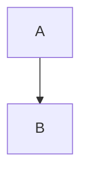

# 사용법 가이드

Markdown to Confluence Converter의 상세 사용법을 안내합니다.

이 도구는 두 가지 방식으로 사용할 수 있습니다.

| 방식 | 설명 | 적합한 상황 |
|---|---|---|
| **브라우저** | `index.html`을 열어 웹 UI에서 실시간 변환 | 단일 문서 작성, 템플릿 활용, 시각적 확인 |
| **CLI** | 터미널에서 `md2confluence` 명령 실행 | 다수 파일 일괄 변환, CI/CD 파이프라인, 자동화 |

---

## 브라우저 사용법

### 화면 구성

화면은 크게 3개 영역으로 나뉩니다.

#### 1. 입력 패널 (좌측)

마크다운 텍스트를 입력하는 영역입니다. 두 가지 탭이 있습니다.

- **텍스트 입력** — textarea에 직접 마크다운을 작성합니다. 입력과 동시에 실시간으로 변환됩니다.
- **파일 업로드** — 마크다운 파일을 드래그 & 드롭하거나 클릭하여 선택합니다.

하단 **Clear** 버튼을 누르면 입력 내용과 변환 결과가 모두 초기화됩니다.

#### 2. 출력 패널 (우측)

변환된 Confluence 위키 마크업이 표시되는 읽기 전용 영역입니다.

하단에 다음 컨트롤이 있습니다.

- **Code Theme** — 코드 블록 테마 셀렉터
- **Copy** — 변환 결과를 클립보드에 복사
- **Download** — 변환 결과를 `confluence-markup.txt` 파일로 다운로드

#### 3. 템플릿 영역 (하단)

4종의 사전 정의된 문서 템플릿을 카드 형태로 제공합니다. 클릭하면 해당 마크다운이 입력 패널에 로드되고 즉시 변환됩니다.

### 텍스트 입력 방법

1. 왼쪽 패널에서 **텍스트 입력** 탭이 선택된 상태를 확인합니다.
2. textarea에 마크다운을 입력합니다.
3. 입력 후 약 200ms 뒤 오른쪽 패널에 Confluence 마크업이 자동으로 표시됩니다.

### 파일 업로드 방법

#### 지원 형식

| 항목 | 설명 |
|---|---|
| 확장자 | `.md`, `.markdown`, `.txt` |
| 최대 크기 | 1MB |

#### 업로드 방법

**드래그 & 드롭:**
1. **파일 업로드** 탭을 클릭합니다.
2. 파일을 점선 영역 위로 드래그합니다.
3. 영역이 파란색으로 변하면 파일을 놓습니다.

**클릭 선택:**
1. **파일 업로드** 탭을 클릭합니다.
2. 점선 영역을 클릭합니다.
3. 파일 선택 대화상자에서 파일을 선택합니다.

파일이 로드되면 자동으로 **텍스트 입력** 탭으로 전환되고, 내용이 textarea에 채워지며 변환이 실행됩니다. 업로드된 파일 이름이 표시되며, `×` 버튼으로 파일 정보를 제거할 수 있습니다.

### 결과 복사 / 다운로드

#### 클립보드 복사

1. 오른쪽 패널 하단의 **Copy** 버튼을 클릭합니다.
2. "클립보드에 복사되었습니다" 토스트 메시지가 나타납니다.
3. 버튼이 잠시 "Copied!"로 변경됩니다.

#### 파일 다운로드

1. 오른쪽 패널 하단의 **Download** 버튼을 클릭합니다.
2. `confluence-markup.txt` 파일이 다운로드됩니다.

> 변환 결과가 없으면 복사/다운로드 시 안내 메시지가 표시됩니다.

### 코드 블록 테마 설정

코드 블록에 적용할 Confluence 테마를 선택할 수 있습니다. 오른쪽 패널 하단의 **Code Theme** 드롭다운에서 테마를 변경하면 변환 결과에 즉시 반영됩니다.

#### 제공 테마 (8종)

| 테마 | 설명 |
|---|---|
| Default | Confluence 기본 테마 (테마 파라미터 없음) |
| DJango | 어두운 배경, 녹색 계열 |
| Emacs | Emacs 에디터 스타일 |
| FadeToGrey | 회색 톤 배경 |
| Midnight | 어두운 미드나이트 블루 배경 |
| RDark | 어두운 배경, 밝은 텍스트 |
| Eclipse | Eclipse IDE 스타일 (밝은 배경) |
| Confluence | Confluence 전용 스타일 |

#### 테마 적용 예시

Default 선택 시:
```
{code:language=java}
System.out.println("Hello");
{code}
```

Midnight 선택 시:
```
{code:language=java|theme=Midnight}
System.out.println("Hello");
{code}
```

### 템플릿 사용법

화면 하단에 4종의 문서 템플릿이 카드로 표시됩니다.

| 템플릿 | 설명 |
|---|---|
| 기본 문서 | 제목, 단락, 리스트, 코드 블록이 포함된 기본 문서 구조 |
| 테이블 문서 | 테이블을 활용한 데이터 정리 문서 |
| API 문서 | REST API 엔드포인트 문서 템플릿 |
| 회의록 | 회의 내용, 결정 사항, 액션 아이템 기록용 |

#### 사용 방법

1. 원하는 템플릿 카드를 클릭합니다.
2. 입력 패널에 템플릿 마크다운이 로드됩니다.
3. 오른쪽 패널에 변환 결과가 즉시 표시됩니다.
4. 필요에 따라 내용을 수정하면 실시간으로 재변환됩니다.

> 템플릿을 로드하면 기존 입력 내용이 대체됩니다.

---

## CLI 사용법

터미널에서 마크다운 파일을 Confluence 위키 마크업으로 변환합니다. 다수 파일 일괄 변환, CI/CD 파이프라인 연동 등 자동화에 적합합니다.

### 설치 및 빌드

프로젝트 루트 디렉토리(`package.json`이 있는 위치)에서 아래 명령을 실행합니다.

```bash
cd markdown-to-confluence-converter   # 프로젝트 루트로 이동
npm install                           # marked + esbuild 의존성 설치
npm run build                         # dist/md2confluence.js 단일 파일 생성
```

`npm run build`는 esbuild를 사용하여 `cli.js`, `js/converter.js`, `marked` 라이브러리를 하나의 파일(`dist/md2confluence.js`)로 번들링합니다. 빌드가 완료되면 이 파일 하나만으로 실행할 수 있습니다.

### 팀 배포

빌드된 `dist/md2confluence.js`는 Node.js만 있으면 `node_modules` 없이 독립 실행됩니다. 팀에 배포할 때는 이 파일 하나만 전달하면 됩니다.

```bash
# 빌드 후 배포
cp dist/md2confluence.js /shared/tools/
# 팀원이 사용
node /shared/tools/md2confluence.js README.md
```

### 기본 사용법

#### 단일 파일 변환

```bash
node md2confluence.js README.md
# → README.wiki 생성 (같은 디렉토리)
```

#### 복수 파일 변환

```bash
node md2confluence.js *.md
# → 각 .md 파일에 대응하는 .wiki 파일 생성
```

#### 디렉토리 재귀 변환

```bash
node md2confluence.js -r docs/
# → docs/ 하위의 모든 .md 파일을 재귀적으로 변환
```

#### 출력 디렉토리 지정

```bash
node md2confluence.js -o output/ docs/*.md
# → output/ 디렉토리에 .wiki 파일 생성
```

#### stdin 파이프 (표준 입력 → 표준 출력)

```bash
cat README.md | node md2confluence.js
# → 변환 결과를 stdout으로 출력

echo "# Hello" | node md2confluence.js
# → h1. Hello
```

인자 없이 실행하면 stdin에서 마크다운을 읽고 결과를 stdout으로 출력합니다.

### 옵션 레퍼런스

| 옵션 | 축약 | 설명 |
|---|---|---|
| `--help` | `-h` | 도움말 출력 |
| `--output <경로>` | `-o` | 출력 디렉토리 지정 (기본: 입력 파일과 같은 위치) |
| `--recursive` | `-r` | 디렉토리 하위까지 재귀 탐색 |
| `--theme <테마>` | `-t` | 코드 블록 테마 지정 (예: `Midnight`, `RDark`) |
| `--stdout` | — | 결과를 stdout으로 출력 (파일 미생성) |

#### 테마 옵션 예시

```bash
node md2confluence.js -t Midnight README.md
# → 코드 블록에 theme=Midnight 파라미터 적용
```

### AI 워크플로우 연동 예시

stdin/stdout 파이프를 활용하면 다양한 자동화 워크플로우에 연동할 수 있습니다.

```bash
# Git diff를 Confluence 마크업으로 변환
git diff | node md2confluence.js > changes.wiki

# 여러 파일을 하나로 합쳐서 변환
cat header.md body.md footer.md | node md2confluence.js > combined.wiki

# find와 조합하여 특정 패턴의 파일만 변환
find docs/ -name "*.md" -exec node md2confluence.js -o output/ {} \;

# CI/CD 파이프라인에서 활용
npm run build && node dist/md2confluence.js -r docs/ -o wiki-output/
```

---

## 지원 마크다운 문법 상세

아래 문법은 브라우저와 CLI 모두 동일하게 지원됩니다.

### 제목

```markdown
# h1 제목
## h2 제목
### h3 제목
#### h4 제목
##### h5 제목
###### h6 제목
```

변환 결과:

```
h1. h1 제목
h2. h2 제목
h3. h3 제목
h4. h4 제목
h5. h5 제목
h6. h6 제목
```

### 텍스트 서식

| 마크다운 | 변환 결과 | 설명 |
|---|---|---|
| `**볼드**` | `*볼드*` | 굵은 글씨 |
| `*이탤릭*` | `_이탤릭_` | 기울임 |
| `~~취소선~~` | `-취소선-` | 취소선 |
| `` `인라인코드` `` | `{{인라인코드}}` | 인라인 코드 |

### 링크와 이미지

```markdown
[표시 텍스트](https://example.com)

```

변환 결과:

```
[표시 텍스트|https://example.com]
!https://example.com/image.png|alt=대체 텍스트!
```

### 리스트

```markdown
- 항목 1
- 항목 2
  - 하위 항목 2-1
  - 하위 항목 2-2

1. 첫 번째
2. 두 번째
   1. 하위 첫 번째
```

변환 결과:

```
* 항목 1
* 항목 2
** 하위 항목 2-1
** 하위 항목 2-2

# 첫 번째
# 두 번째
## 하위 첫 번째
```

### 체크박스 (Task List)

```markdown
- [x] 완료된 항목
- [ ] 미완료 항목
```

변환 결과:

```
* (/) 완료된 항목
* (x) 미완료 항목
```

### 테이블

```markdown
| 헤더 1 | 헤더 2 | 헤더 3 |
|--------|--------|--------|
| 셀 1   | 셀 2   | 셀 3   |
| 셀 4   | 셀 5   | 셀 6   |
```

변환 결과:

```
|| 헤더 1 || 헤더 2 || 헤더 3 ||
| 셀 1 | 셀 2 | 셀 3 |
| 셀 4 | 셀 5 | 셀 6 |
```

### 코드 블록

````markdown
```javascript
function hello() {
  console.log("Hello!");
}
```
````

변환 결과:

```
{code:language=javascript}
function hello() {
  console.log("Hello!");
}
{code}
```

### 인용

```markdown
> 이것은 인용문입니다.
```

변환 결과:

```
{quote}
이것은 인용문입니다.
{quote}
```

### 수평선

```markdown
---
```

변환 결과:

```
----
```

## 특수 처리 사항

### 중괄호 이스케이프

Confluence 위키 마크업에서 중괄호(`{`, `}`)는 매크로 구문으로 사용되기 때문에, 일반 텍스트와 인라인 코드에서 자동으로 이스케이프(`\{`, `\}`)됩니다.

**마크다운 입력:**
```markdown
변수 `${name}`을 사용합니다.
JSON 형식은 { key: value } 입니다.
```

**변환 결과:**
```
변수 {{$\{name\}}}을 사용합니다.
JSON 형식은 \{ key: value \} 입니다.
```

> 코드 블록(`{code}`) 내부의 중괄호는 이스케이프되지 않습니다.

### Mermaid 코드 블록 접기

Confluence는 Mermaid 다이어그램을 기본 지원하지 않으므로, Mermaid 코드 블록은 자동으로 접기(collapse) 처리됩니다.

**마크다운 입력:**
````markdown

````

**변환 결과:**
```
{code:language=text|title=mermaid|collapse=true}
graph TD
    A --> B
{code}
```

- 언어가 `text`로 변경됩니다.
- `title=mermaid`이 추가되어 원래 Mermaid 코드임을 표시합니다.
- `collapse=true`로 기본 접힘 상태가 됩니다.
